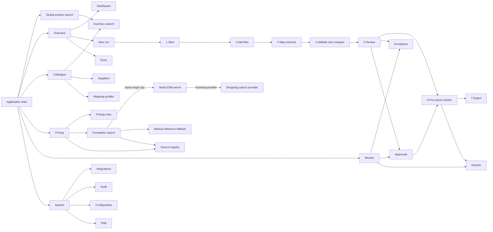

# SWL interface map

Text equivalent: the persistent desktop rail or mobile menu exposes five route groups containing all 16 surfaces. The global product search opens Inventory search. New run contains the seven ordered stages Start, Add files, Map columns, Validate and compare, Review, Pre-export checks and Export. Review feeds the Exceptions and Approvals workspaces; approved eligible rows proceed through pre-export checks to the five candidate outputs. Competitor search calls only the same-origin Node ESM server, which accesses the licensed provider server-side, and also provides manual reference fallback and source-registry access.

## Validation matrix

| Area                |                                                     Required nodes | Repository implementation                                |
| ------------------- | -----------------------------------------------------------------: | -------------------------------------------------------- |
| Shell               | Navigation, global search, run status, privacy, theme and settings | `src/App.tsx`                                            |
| Routes              |                                                                 16 | Hash route table and grouped navigation in `src/App.tsx` |
| Run workflow        |                                                           7 stages | `STEP_ORDER`, `STEP_TITLES` and `src/ui/steps/`          |
| Operational review  |                          Review, exceptions, approvals and exports | Route pages and run steps under `src/ui/`                |
| Competitor boundary |                  Browser to own-origin server to licensed provider | `src/core/liveSearch.ts` and `server/`                   |

The map was reconciled with the live route table and workflow step order. It deliberately shows competitor evidence as an input to review rather than to pricing calculation or export mutation.
