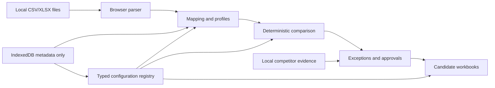

# Architecture

Text equivalent: local files enter browser-only parsing, confirmed mappings and profiles feed deterministic comparison, configuration supplies safe rules, competitor evidence is reviewed locally, approved valid changes generate candidate outputs, and IndexedDB stores only approved metadata unless a snapshot is explicitly confirmed.

The React shell uses hash routes for GitHub Pages. Domain modules under `src/core` hold parsing-adjacent logic, comparison, pricing, output eligibility, configuration, competitor recommendations, operational exceptions, proposals and run metadata. UI route components call those modules and do not perform spreadsheet algorithms directly.
