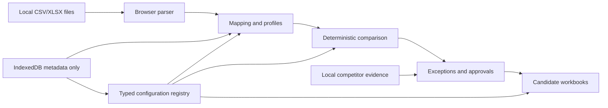

# Architecture

Text equivalent: local files enter browser-only parsing, confirmed mappings and profiles feed deterministic comparison, configuration supplies safe rules, competitor evidence is reviewed locally, approved valid changes generate candidate outputs, and IndexedDB stores only approved metadata unless a snapshot is explicitly confirmed.

The React shell uses hash routes for GitHub Pages. Domain modules under `src/core` hold parsing-adjacent logic, comparison, pricing, output eligibility, configuration, competitor recommendations, operational exceptions, proposals and run metadata. UI route components call those modules and do not perform spreadsheet algorithms directly.

## Desktop shell (Windows)

`src-tauri/` packages the identical web bundle as a Tauri 2 Windows application. The frontend
detects the shell through the injected `window.__TAURI__` global (`src/platform/desktop.ts`)
and, when present, offers a native output-folder workflow on the Export step. The Rust side
exposes exactly three commands: `choose_output_folder` (native picker), `write_export_file`
(sanitised filename, traversal-guarded write into the chosen folder) and `shell_info`. The
desktop build uses `vite build --mode desktop`, which relaxes the Content Security Policy only
enough to reach the local Tauri IPC bridge; the web build keeps `connect-src 'none'`. Product
search lives in `src/core/search.ts` (deterministic exact-first ranking) and is exercised by
unit and end-to-end tests.
