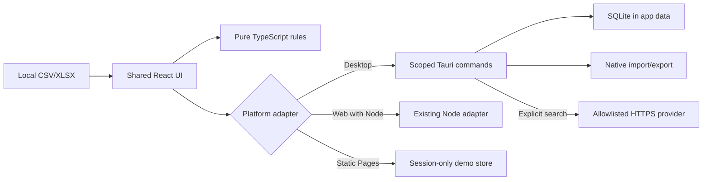
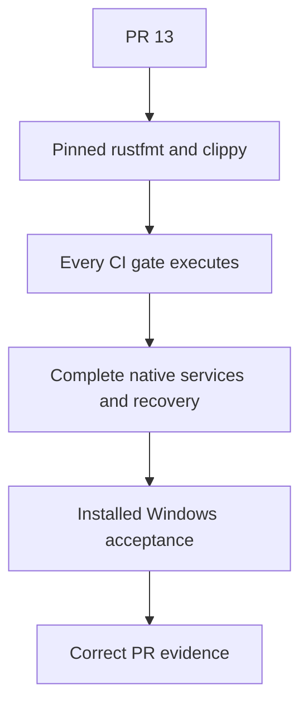

# Architecture

Rendered companion: [SWL desktop architecture and PR evidence flow](architecture-desktop.svg).

Text equivalent: local files enter one shared React interface and pure TypeScript business rules. A typed platform boundary sends desktop operations to narrowly scoped Rust commands, local SQLite and native import/export, while the server-backed web demonstration retains the Node adapter and static Pages uses a no-network session-only store. Optional user-initiated search may leave the computer only through approved HTTPS provider hosts; when it is unconfigured or offline, manual evidence remains available.

The React shell uses hash routes. GitHub Pages alone serves the static demonstration surface; its
web adapter deterministically switches to a no-network, in-memory operational session for that
build. Approved catalogue records, approval/history records, references and source changes expire
on refresh, while operator-authored configuration remains in IndexedDB. Server-backed live search
and durable JSON/JSONL persistence need the Node adapter (`npm run server`). The
desktop application does not use that server: the same typed platform contract routes to Tauri IPC,
Rust-owned SQLite and native file/search services. Domain modules under `src/core` hold
parsing-adjacent logic, comparison, pricing, output eligibility, configuration, competitor
recommendations, operational exceptions, proposals and run metadata. UI route components call
those modules and do not perform spreadsheet algorithms directly.

## Desktop shell (Windows)

`src-tauri/` packages the identical web bundle as a Tauri 2 Windows application. The frontend
uses the reviewed imported Tauri API and typed contract under `src/platform/`. The Rust side owns
SQLite, ordered migrations, backups and restore, native file authority, optional provider search
and protected credential operations. Custom permissions group read, write, recovery, search and
file commands for the main window; broad dialog, shell, process, filesystem and HTTP permissions
are not granted. The desktop bundle receives one CSP from Tauri, while the web build permits
`connect-src 'self'` only. Product search lives in `src/core/search.ts` and is exercised by unit
and end-to-end tests.

## Pull-request evidence flow

Text equivalent: continue PR 13, provision the complete pinned Rust toolchain, execute every
previously skipped gate, finish the native services and recovery boundaries, validate the
installed Windows application and then publish only truthful evidence to the pull request.
