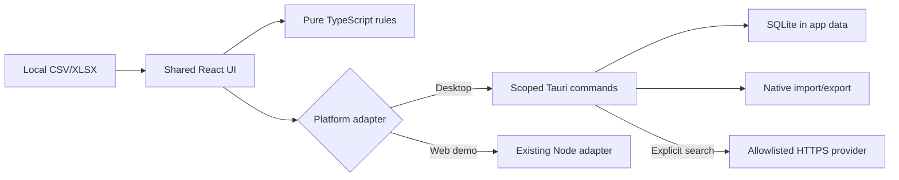

# Architecture

Text equivalent: local files enter one shared React interface and pure TypeScript business rules. A typed platform boundary sends desktop operations to narrowly scoped Rust commands, local SQLite and native import/export, while the web demonstration retains the Node adapter. Optional user-initiated search will leave the computer only through approved HTTPS provider hosts; until a credential-backed native provider is configured it remains explicitly not configured.

The React shell uses hash routes. GitHub Pages alone can serve the static SPA, but the full application (live search plus persistence) needs the Node server (`npm run server`), which also serves `dist/` in production as a single origin. Domain modules under `src/core` hold parsing-adjacent logic, comparison, pricing, output eligibility, configuration, competitor recommendations, operational exceptions, proposals and run metadata. UI route components call those modules and do not perform spreadsheet algorithms directly.

## Desktop shell (Windows)

`src-tauri/` packages the identical web bundle as a Tauri 2 Windows application. The frontend
uses the reviewed imported Tauri API (`src/platform/desktop.ts`)
and, when present, offers a native output-folder workflow on the Export step. The Rust side
exposes a narrow command set for database health and append-only approvals plus `choose_output_folder`, `write_export_file`
(sanitised filename, traversal-guarded atomic write into the chosen folder) and `shell_info`. The
desktop build uses `vite build --mode desktop`, which relaxes the Content Security Policy only
enough to reach the local Tauri IPC bridge; the web build permits `connect-src 'self'` only. Product
search lives in `src/core/search.ts` (deterministic exact-first ranking) and is exercised by
unit and end-to-end tests.
