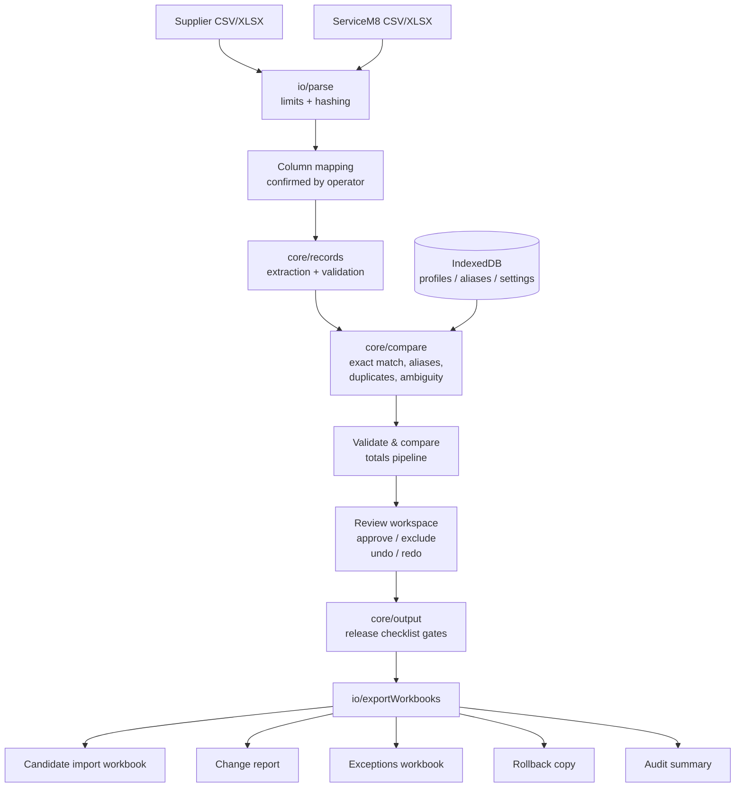

# Architecture

SWL Pricing and Inventory Control is a static, local-first single-page application:
Vite + React 19 + TypeScript (strict). There is no backend of any kind.

## Design rules

- **Business logic is framework-independent.** Everything under `src/core/` is pure TypeScript
  with no React, DOM or storage dependencies; transformations are pure functions.
- **UI components contain no parsing, matching or pricing logic.** They render state and dispatch
  actions.
- **Money never touches binary floats.** Amounts are big.js decimals inside calculations and
  canonical `"130.00"` strings across module boundaries.
- **All imported data stays in memory.** Only operator-authored configuration is persisted.

## Module layout

| Module                      | Responsibility                                                                 |
| --------------------------- | ------------------------------------------------------------------------------ |
| `src/core/money.ts`         | AUD parsing, decimal-safe 30% markup, half-up rounding, formatting             |
| `src/core/normalize.ts`     | Identifier normalisation (trim + uppercase only) and description normalisation |
| `src/core/similarity.ts`    | Deterministic description similarity (suggestions only)                        |
| `src/core/fields.ts`        | Conceptual mapping fields for both files                                       |
| `src/core/mapping.ts`       | Mapping suggestions, validation, mapping profiles                              |
| `src/core/records.ts`       | Row extraction + per-row validation (supplier / ServiceM8)                     |
| `src/core/compare.ts`       | Matching hierarchy, duplicate/ambiguity detection, status classification       |
| `src/core/statuses.ts`      | Status model and approval eligibility rules                                    |
| `src/core/review.ts`        | Decisions, undo/redo, history, carry-forward across re-runs                    |
| `src/core/output.ts`        | Import-output filtering and the release checklist gates                        |
| `src/core/audit.ts`         | Audit summary generation                                                       |
| `src/core/sanitize.ts`      | Spreadsheet formula-injection neutralisation, filename sanitisation            |
| `src/core/run.ts`           | Run identifiers and deterministic output filenames                             |
| `src/core/settings.ts`      | Settings schema (markup, tax handling, theme)                                  |
| `src/io/parse.ts`           | CSV (PapaParse) and XLSX (ExcelJS) ingestion with defensive limits             |
| `src/io/limits.ts`          | Documented parsing limits                                                      |
| `src/io/hash.ts`            | Local SHA-256 of input files (WebCrypto)                                       |
| `src/io/exportWorkbooks.ts` | The five generated outputs                                                     |
| `src/io/download.ts`        | Local blob downloads                                                           |
| `src/storage/db.ts`         | IndexedDB stores: profiles, aliases, settings (nothing else)                   |
| `src/state/store.tsx`       | React context + reducer (session state)                                        |
| `src/state/useActions.ts`   | Async orchestration (parse, persist, export) around the pure core              |
| `src/ui/**`                 | Presentation components: shell, steps, dialogs, table                          |
| `src/demo/fixtures.ts`      | Clearly fictional demonstration data                                           |

## Data flow

Every stage left of the outputs runs in browser memory. The only writes are the operator's
explicit downloads and the three IndexedDB configuration stores.

## State model

A single reducer (`src/state/store.tsx`) owns session state: file slots, mappings, the
comparison result, review decisions (with undo/redo stacks), settings and generated outputs.
Any change to files, mappings or business-rule settings invalidates the comparison; re-running
carries forward only decisions whose row identity, status and proposed price are unchanged, and
warns the operator beforehand.

## Security posture

- Production CSP: `default-src 'none'` with narrow allowances; `connect-src 'none'` blocks all
  fetch/XHR/WebSocket/beacon traffic.
- Formula-like cell values are flagged on input and neutralised on output; generated cells are
  string-typed so spreadsheet applications never evaluate them.
- Defensive parse limits guard against oversized or malformed workbooks
  (see `docs/FILE-FORMAT-CONTRACT.md`).
