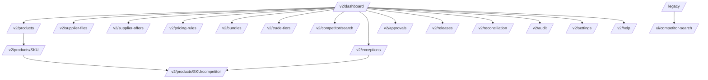

# Pricing Control Hub v2 Site Map

Local prototype only. Production write access is not authorised.

Text equivalent: the dashboard links to every section. Products lead to product detail and then to the product competitor evidence page. The exception queue links back to competitor evidence. The legacy address redirects to the original competitor search page, which remains available.

## Route list

| Route | Purpose | Data |
|---|---|---|
| /v2/dashboard | Status cards, quick actions, recent audit | Live local data |
| /v2/products | Searchable filterable product table | Live local data |
| /v2/products/{sku} | Product detail, offers, recommendations, audit | Live local data |
| /v2/products/{sku}/competitor | Evidence, observation form, recommendation | Live local data |
| /v2/supplier-files | Supplier file records | Shell, backend dependency recorded |
| /v2/supplier-offers | Offers and multi supplier comparison | Live local data |
| /v2/pricing-rules | Rule precedence and global default | Global rule live, scoped rules are a dependency |
| /v2/bundles | Bundle components and warnings | Shell, backend dependency recorded |
| /v2/trade-tiers | Tier definitions and floor flags | Shell, backend dependency recorded |
| /v2/competitor/search | Global local competitor search | Live local data |
| /v2/exceptions | Exception queue with filters | Live local data |
| /v2/approvals | Proposal summary and line item review | Live local data, proposal only |
| /v2/releases | Read only release records | Live local data, no release action |
| /v2/reconciliation | Mock reconciliation | Live proposals, placeholder actuals |
| /v2/audit | Audit event log with filters | Live local data |
| /v2/settings | Local configuration and feature flags | Live local configuration |
| /v2/help | Glossary, formulas, rules, limitations | Static help content |
| /legacy | Redirect to the pre v2 experience | Redirect |
| /ui/competitor-search | Original v1 competitor page | Unchanged |
